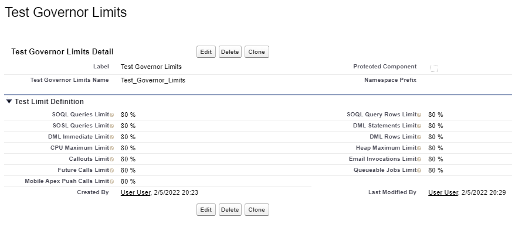
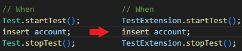

# Tests Governor Limits Coverage

The Tests Governor Limits Coverage allows you to set a customizable limit for your tests, so it is easier for developers to build complex software which always complies with the Salesforce Governor Limits for Apex code.

## How to configure your custom limits

Go to your org **Setup**, and there **Custom Metadata Types**, select the **Manage Records** for Test Governor Limits object. Select the unique record from the list view.

There you should be able to see a complete list of all the Apex Governor Limits that you can configure for your tests in that environment.

## Extending your tests

In order to be able to benefit from the customizable limits in your tests, you will simply need to update your Apex Test classes just as follows:

That way from now on, your tests will run after your customized settings.
